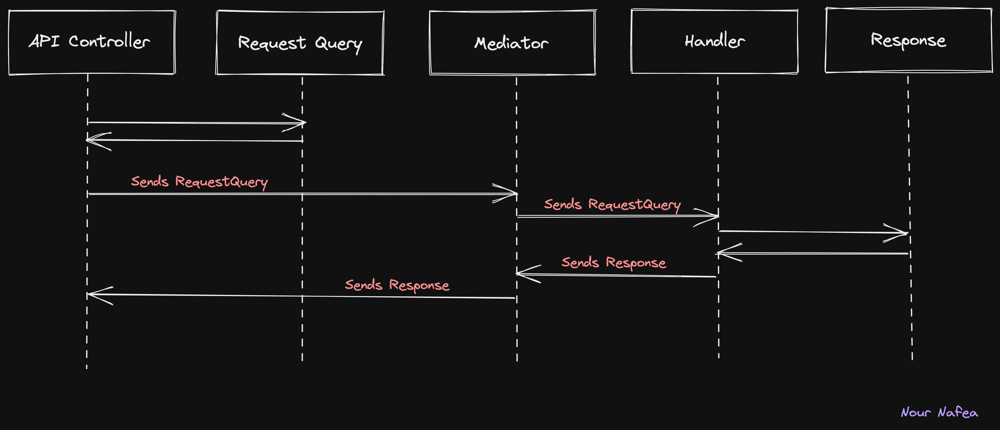

# Mediator
How Mediator works with APIs?
Suppose we have an API controller. It's going to have this RequestQuery object, think of it is just like an ID parameter. It's going to send this RequestQuery object to the mediator. The mediator decides which handler to invoke and sends this object onto that handler. The handler does the business logic it needs, creates the response objects it's supposed to create, and sends us back to the mediator. The mediator will then send it back to the API Controller. 

